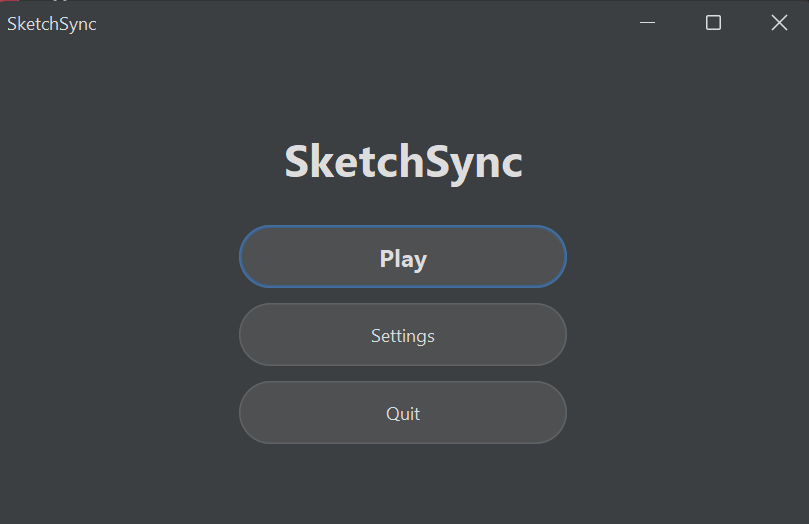
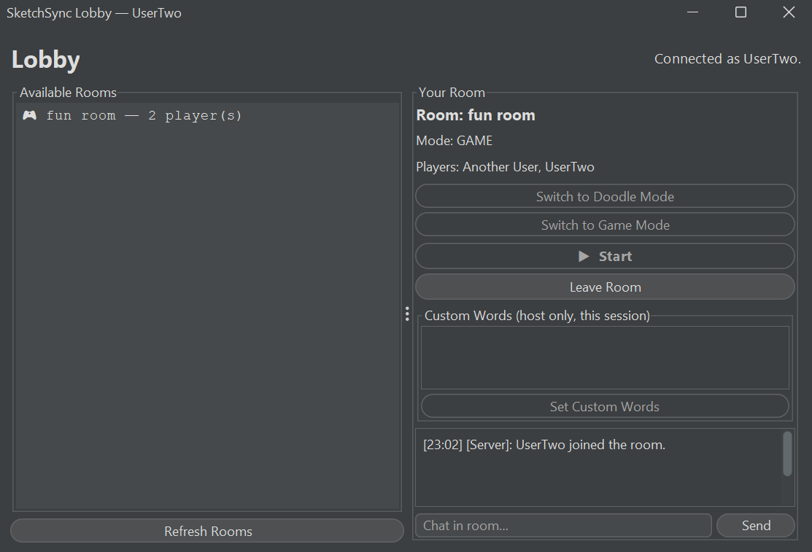
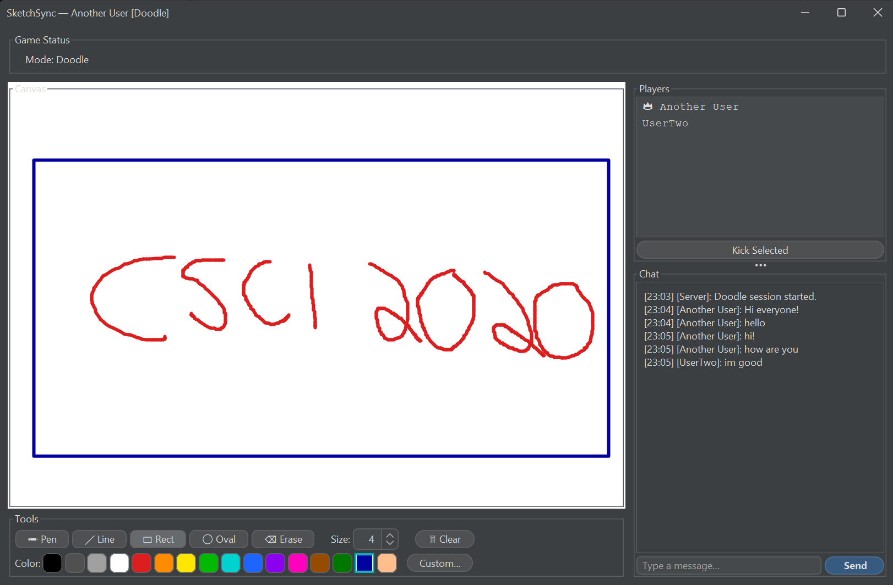

# SketchSync

## Project Note

SketchSync was originally developed as a group project for a university course.  
I had permission to publish this version in my personal portfolio.

My main contributions included the Java Swing client interface, client-server connection flow, UI integration, and parts of the multiplayer game flow. The project has been cleaned up and presented here for portfolio purposes.

> A real-time multiplayer draw-and-guess game built in Java.

One player draws a secret word on a shared canvas while everyone else races to guess it in chat. Supports multiple simultaneous rooms, a free-draw Doodle mode, persistent leaderboards, and a full lobby system. Built with Java Swing and TCP sockets following CSCI2020U patterns.

---

## Team

| Name | Role                                                    |
|---|---------------------------------------------------------|
| Jordan Tackaberry | Multi-threaded server, Word system, Game UI             |
| Fahad Mughal | Socket networking, Game logic, Documentation            |
| Hadi Rana | GUI implementation, Debugging, Documentation |
| Aaron Christian | Persistence (File I/O), Room system, Game logic         |

---

## Screenshot

<!-- Replace the line below with your actual screenshot after running the game -->
<!--  -->

> Attached below are the screenshots of the three main components of the project: Home Page, Lobby Room, and Doodle Board.
> ### 1. Home Page 
> 
> ### 2. Lobby Room
> 
> ### 3. Doodle Board
> 

---

## Video Demo

> Attached below is the shareable link for accessing the video demo of our project.
> It covers all the 'Features Delivered' functions listed in CHARTER.md.
> Please note that the demo includes two parts: Doodle Mode and Game Mode.

**Demo link:** https://drive.google.com/file/d/1XWLn6ruR_vqw3NRqBBFja1h3ZI7tEqB8/view?usp=drive_link

---

## How to Run

**Prerequisites:** Java 17+, Maven 3.6+

### 1. Clone and build
```bash
git clone https://github.com/OntarioTech-CS-program/w26-csci2020u-finalproject-w26-team34.git
cd sketchsync
mvn compile
```

### 2. Start the server (Terminal 1)
```bash
mvn exec:java -Dexec.mainClass="server.ServerMain"
```

### 3. Start one or more clients (each in a new terminal)
```bash
mvn exec:java -Dexec.mainClass="client.ClientMain"
```

The launcher screen appears — click **Settings** to set your username and the server IP (`localhost` for same machine, or the host's LAN IP for cross-machine play), then click **Play**. Once connected you land in the **Lobby**, where you can create or join a room.

### Running multiple clients in IntelliJ (for local testing)
1. Open `ClientMain.java` and click the green ▶ next to `main`
2. Go to **Run → Edit Configurations**, find `ClientMain`, and check **Allow multiple instances**
3. Click ▶ again for each additional client you want

---

## Features

### Core Game
- **Draw & Guess** — one drawer, everyone else guesses via chat
- **Word choice** — drawer picks from 3 options at the start of each round (15-second auto-fallback)
- **Hint system** — drawer can reveal up to 2 letters per round; guessers see a masked hint (e.g. `_ p p _ e`) with the word length shown below
- **Scoring** — guessers earn 100 points per correct answer; the drawer earns 20 points per guesser who guesses correctly
- **Timer** — 60-second countdown; turns red and plays sound at ≤10 seconds, urgent sound at ≤3 seconds
- **Auto-restart** — new game begins automatically 10 seconds after the final round

### Rooms & Lobby
- **Lobby system** — browse, create, and join named rooms before playing
- **Two room modes** — **Game** (structured draw-and-guess) or **Doodle** (free collaborative canvas with chat)
- **Host controls** — switch mode, kick players, set custom word lists, start the game manually
- **Custom word lists** — host can enter comma-separated words for a session (e.g. `rocket, volcano, saxophone`); not saved to disk, applies to that game only
- **Duplicate username rejection** — server rejects duplicate usernames at connection time

### Canvas & Tools
- **Drawing tools** — Freehand pen, Line, Rectangle, Oval, Eraser
- **Colour palette** — 16 preset swatches + a Custom colour chooser (`JColorChooser`)
- **Stroke size** — adjustable 1–40px spinner
- **Canvas sync** — late joiners receive the full canvas history on entry
- **Clear canvas** — clears locally first for instant feedback, then broadcasts to all

### Persistence
- **Leaderboard** — all-time scores saved to `leaderboard.txt`; shown at game end as a dialogue
- **Game state** — current round, scores, and drawer saved to `gamestate.txt` after every event

### UX
- **Chat timestamps** — every chat message is prefixed with `[HH:mm]`
- **Sound effects** — synthesized tones (no audio files required): countdown tick, urgent beep, correct-guess ding, round-end tone
- **FlatLaf theming** — modern flat UI via FlatLaf library
- **Host indicator** — 👑 crown next to the host's name in the player list

---

## How It Works

### Network Architecture
Follows the **Client/Server** model from CSCI2020U Module 6:
- `ServerMain` opens a `ServerSocket` on port **5000** and loops on `accept()`
- Each accepted connection gets its own `ClientHandler` thread (Module 7 Runnable pattern)
- All communication uses Java **object serialization** over TCP (`ObjectOutputStream` / `ObjectInputStream`)
- `ObjectOutputStream` is always created and flushed **before** `ObjectInputStream` on both sides to prevent the stream-header deadlock
- `output.reset()` is called before every `writeObject` to prevent Java's OOS object-caching from delivering stale payloads on repeated sends

### Message Protocol
Every packet is a `Message` object:

| Field | Type | Purpose |
|---|---|---|
| `type` | `MessageType` | How to interpret the payload |
| `sender` | `String` | Username or `"Server"` |
| `payload` | `Object` | `String`, `DrawData`, `RoomInfo`, `Integer`, or `null` |

| MessageType | Direction | Meaning |
|---|---|---|
| `JOIN` / `LEAVE` | Server → All | Player joined or left |
| `CHAT` | Both | Chat message or wrong guess |
| `DRAW_DATA` | Client → Server → Others | One stroke segment |
| `CLEAR_CANVAS` | Both | Clear the drawing canvas |
| `ROLE_ASSIGNMENT` | Server → Client | `"Drawer"` or `"Guesser"` |
| `SECRET_WORD` | Server → Drawer only | The word to draw |
| `WORD_CHOICE` | Server → Drawer | Three word options (comma-separated) |
| `WORD_SELECTED` | Drawer → Server | Chosen word |
| `WORD_LENGTH` | Server → Guessers | Letter count for the current word |
| `HINT` | Server → Guessers | Masked hint string e.g. `_ p p _ e` |
| `HINT_REQUEST` | Drawer → Server | Request a letter reveal |
| `ROUND_START` | Server → All | Round number |
| `ROUND_END` | Server → All | End-of-round message + word reveal |
| `SCORE_UPDATE` | Server → All | Full scoreboard string |
| `TIMER_UPDATE` | Server → All | Seconds remaining |
| `LEADERBOARD_UPDATE` | Server → All | All-time leaderboard at game end |
| `ROOM_LIST` | Server → Lobby | List of open rooms |
| `CREATE_ROOM` | Client → Server | Create a new room |
| `JOIN_ROOM` | Client → Server | Join an existing room |
| `LEAVE_ROOM` | Client → Server | Leave current room |
| `ROOM_UPDATE` | Server → Room | Room membership / state update |
| `SET_MODE` | Host → Server | `"DOODLE"` or `"GAME"` |
| `START_GAME` | Host → Server | Manually start the session |
| `KICK` | Host → Server | Kick a player from the room |
| `KICKED_TO_LOBBY` | Server → Client | Kicked — returned to lobby |
| `CUSTOM_WORD_LIST` | Host → Server | Comma-separated custom words |
| `LOBBY_ERROR` | Server → Client | Human-readable error message |

### Game Flow
1. Client connects → lands in the **Lobby**
2. Host creates a room, others join; host sets mode (Game or Doodle) and clicks Start
3. **Each round:** drawer is chosen round-robin, picks from 3 word options, draws while guessers type in chat
4. Correct guess = **100 points** for guesser + **20 points** for drawer
5. Masked hint shown from the start; drawer can reveal up to 2 letters
6. Round ends when all guessers guess correctly, or 60 seconds elapse
7. After **3 rounds**, final scores + all-time leaderboard are shown; new game auto-starts after 10 seconds

---

## Project Structure

```
sketchsync/
├── .gitattributes                     Ensures consistent LF line endings across platforms
├── pom.xml                            Maven build (Java 17, FlatLaf, exec-maven-plugin)
├── gamestate.txt                      Auto-generated at runtime — current game state
├── leaderboard.txt                    Auto-generated at runtime — all-time scores
│
└── src/main/
    ├── resources/
    │   └── words.txt                  Default word bank (55 words, one per line)
    │
    └── java/
        ├── server/
        │   ├── ServerMain.java        TCP accept-loop, handshake, thread spawning.
        │   │                          Networking only — delegates logic to RoomManager/GameManager.
        │   ├── RoomManager.java       Owns all rooms. Handles CREATE_ROOM, JOIN_ROOM,
        │   │                          LEAVE_ROOM, SET_MODE, START_GAME, KICK.
        │   ├── Room.java              One room: member list, mode, canvas history,
        │   │                          kick list, GameManager lifecycle.
        │   ├── GameManager.java       All game logic: word choice, hints, guess checking,
        │   │                          scoring (guessers + drawer), timers, auto-restart.
        │   │                          Configure rules (ROUND_TIME, MAX_ROUNDS…) here.
        │   └── ClientHandler.java     One Runnable thread per client. Routes messages to
        │                              Room or RoomManager. Uses output.reset() before sends.
        │
        ├── client/
        │   ├── ClientMain.java        Entry point — launches LauncherFrame on the EDT.
        │   ├── ClientConnection.java  Synchronized TCP wrapper. Background listener thread.
        │   ├── ClientSettings.java    Persists username + host between sessions.
        │   └── ui/
        │       ├── LauncherFrame.java Splash / settings screen. Handles connection handshake.
        │       ├── LobbyFrame.java    Room browser. Create/join rooms, set mode, custom words.
        │       ├── GameFrame.java     Main game window: canvas, toolbar, hints, chat + timestamps,
        │       │                      player list, kick button, leaderboard dialog.
        │       ├── DrawingPanel.java  JPanel canvas. Freehand, Line, Rect, Oval, Eraser tools.
        │       │                      Replays canvas history for late joiners.
        │       ├── SoundPlayer.java   Synthesizes PCM tones at runtime (no audio files needed).
        │       └── AppTheme.java      FlatLaf theme configuration.
        │
        └── shared/
            ├── Message.java           Network envelope: type + sender + payload.
            ├── MessageType.java       All message type constants.
            ├── DrawData.java          Serializable stroke: coordinates, colour, width, tool.
            ├── Player.java            Username, score, role, guess status.
            ├── RoomInfo.java          Serializable room snapshot sent to lobby clients.
            ├── DataManager.java       Coordinates WordRepository, GameState, Leaderboard.
            ├── WordRepository.java    Loads words.txt; provides random + three-word selection.
            ├── GameState.java         Saves/loads game state to/from gamestate.txt.
            └── Leaderboard.java       Loads/saves all-time scores to/from leaderboard.txt.
```

---

## Configuration

All game rules are constants at the top of `GameManager.java`:

```java
public static final int ROUND_TIME               = 60;  // seconds per round
public static final int MAX_ROUNDS               = 3;   // rounds before game restarts
public static final int MIN_PLAYERS              = 2;   // players needed to start
public static final int GUESS_SCORE              = 100; // points for a correct guess
public static final int DRAWER_SCORE_PER_GUESSER = 20;  // points drawer earns per correct guesser
public static final int WORD_CHOICE_SECS         = 15;  // seconds to pick a word before auto-assign
public static final int MAX_HINTS_PER_ROUND      = 2;   // max letter reveals per round
```

Server port is set in `ServerMain.java`:
```java
private static final int PORT = 5000;
```

---

## AI & References

### AI Usage
This project used **ChatGPT** and **Microsoft Copilot** as development aids:
- Debugging the `ObjectOutputStream` stream-header deadlock (flush ordering)
- Identifying and fixing the OOS object-caching bug (`output.reset()`)
- Refactoring `ServerMain` into `ServerMain` + `GameManager` + `RoomManager` + `Room`
- Proper implementation and project structuring of features: eraser tool, colour palette, player list panel, word choice dialogue, hint system, kick, persistent leaderboard, countdown sounds, chat timestamps, custom word lists, drawer scoring, word length hint
- Code review, bug identification, and assistance with README documentation formatting
- Revision of class module concepts in application of the project design

All AI-assisted code was reviewed, understood, and integrated by team members. The core socket architecture and threading model were designed by the team. Every team member is accountable for all submitted code.

### References
- [Java SE 17 Documentation — java.net.ServerSocket](https://docs.oracle.com/en/java/docs/api/java.base/java/net/ServerSocket.html)
- [Java SE 17 Documentation — ObjectOutputStream](https://docs.oracle.com/en/java/docs/api/java.base/java/io/ObjectOutputStream.html)
- [Java Swing Tutorial — Oracle](https://docs.oracle.com/javase/tutorial/uiswing/)
- [Java Concurrency — CopyOnWriteArrayList](https://docs.oracle.com/en/java/docs/api/java.base/java/util/concurrent/CopyOnWriteArrayList.html)
- [FlatLaf — Flat Look and Feel for Java Swing](https://www.formdev.com/flatlaf/)
- [javax.sound.sampled — Java Audio API](https://docs.oracle.com/en/java/docs/api/java.desktop/javax/sound/sampled/package-summary.html)
- CSCI2020U Lecture Slides: Module 1 (Version Control), Module 2 (Build Tools), Module 3 (Soft Design & Best Practices), Module 4 (User Interface), Module 5 (Files, Input & Output), Module 6 (Sockets and Access Data), Module 7 (Parallel Programming)
